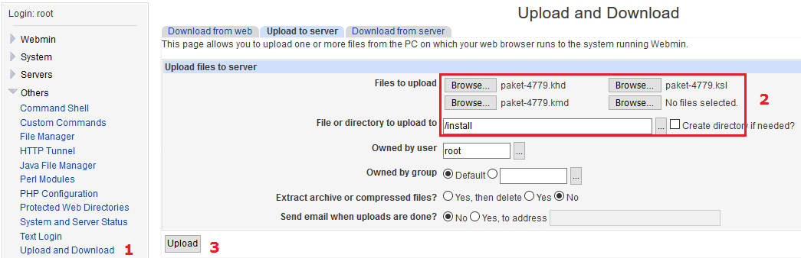
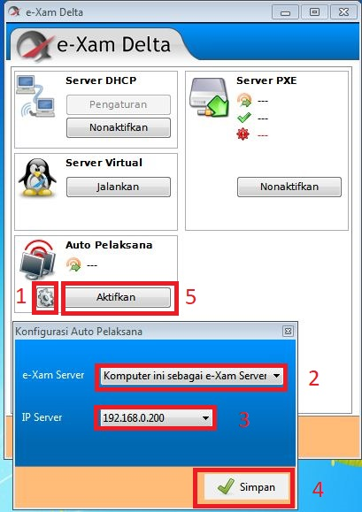
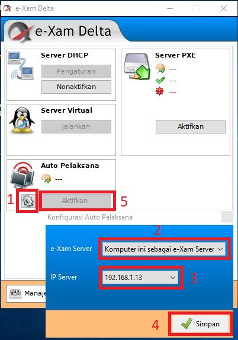

# Instalasi dan Konfigurasi Aplikasi e-Xam : Pengelola, Pelaksana dan Delta

## e-Xam Pengelola

1. Pastikan aplikasi Virtualbox sudah terinstall.  
2. Extract aplikasi e-Xam Server, klik kanan pilih “Extract Here” \(Pastikan aplikasi untuk WinRar atau sejenis sudah terinstall\).

     

3. Buka folder hasil extract, kemudian jalankan \(klik 2x\) e-Xam Server.vbox

   

4. Lakukan **Konfigurasi** dengan meng-klik menu **Setting** seperti gambar berikut :

    

   **Keterangan :**

   * Klik menu Setting **\(Nomor 1\)**
   * Klik menu Network **\(Nomor 2\)**
   * Adapter 1, Enable Network Adapater **\(Nomor 3\)**
   * Attaced to Pilih NAT **\(Nomor 4\)**
   * Klik Adapter 2 **\(Nomor 5\)**
   * centang Enable Network Adapater **\(Nomor 6\),**
   * Pilih Bridged Adapter **\(Nomor 7\)**,
   * Pilih Ethernet **\(Misalnya : Realteck PCIe Family Controller\)** yg saat ini digunakan untuk internet di PC Server **\(Nomor 8\)**,
   * Klik OK untuk menyimpan konfigurasi **\(Nomor 9\)**.

5. Pilih e-Xam Server kemudian tekan tombol “Start”.

   

   Tunggu hingga muncul jendela seperti dibawah ini.

   

6. Buka halaman Pengelola menggunakan web browser ketikkan alamat [http://localhost:8416](http://localhost:8416), maka ditampilkan seperti berikut :

   

7. Langkah berikutnya buka webmin dengan alamat [https://localhost:10000](https://localhost:10000).

   

8. Login webmin dengan username \(**root**\) dan password \(**examserver**\).
9. Upload file reginfo.txt dan proginfo.txt pada direktori **/srv/exam/pengelola/etc** seperti gambar.

   

   Keterangan :

   * **reginfo.txt** = register informasi TUK
   * **proginfo.txt** = program informasi kegiatan \(bisa berganti sesuai kegiatan\)

10. Buka browser isikan alamat [http://localhost:8416](http://localhost:8416), ID LOGIN : **mimin** KATA SANDI : **12345**

    

11. Jika sesuai tampil seperti gambar di bawah ini :

    

    Cek versi digunakan melihat versi aplikasi pusat, apabila muncul “**Aplikasi Terbaru**” e-Xam Pengelola siap digunakan, kalau “**Aplikasi Harus Diperbaharui**” maka e-Xam Pengelola harus dilakukan pembaharuan.

12. Sebelum melakukan pembaharuan Pengelola, install terlebih dahulu aplikasi **e-Xam Delta**. Installasi e-Xam Delta cukup ikuti perintah yang ditampilkan sampai selesai, setelah itu jalankan e-Xam Delta.

    

13. Untuk melakukan pembaharuan e-Xam Pengelola, login melalui console Vbox \(username:**root** dan password:**examserver**\). Pastikan koneksi Internet tersambung dengan server pusat, ketikkan **ukgtool update** tunggu sampai seperti gambar berikut :

    

    Restart e-Xam Pengelola dengan perintah reboot, tunggu sampai muncul tampilan login.

14. Refresh/reload halaman Pengelola akan ditampilkan :

    

15. Server TUK wajib diregister agar server bisa digunakan ujian, klik **Register** **Ajukan Pendaftaran**.

    

    Proses register akan disetujui oleh Admin Pusat, setelah disetujui maka Identitas Server menjadi **Sudah terdaftar** seperti gambar berikut :

    

16. Langkah berikutnya adalah upload dan install paket soal, upload paket soal melalui webmin \([https://localhost:10000](https://localhost:10000)\).

    

    Setelah upload paket soal selesai, kembali pada beranda e-Xam Pengelola pilih **Paket soal** **Opsi modul** “Pilih paket yang akan diinstall” Klik **Install** \(tunggu sampai selesai\).

    

    Apabila soal berhasil diinstall seperti gambar berikut :

    

    Klik menu Paket Soal, maka ditampilkan paket soal yang terinstall.

    

     = mengaktifkan/mengnonaktifkan paket soal

     = cek integritas paket soal, pastikan “**soal seluruh berkas kelengkapan valid”**.

17. Langkah selanjutnya sinkronisasi data peserta, klik Sinkronisasi Data Peserta tunggu sampai selesai seperti gambar berikut :

    

    Selesai sinkronisasi data peserta, klik menu Pengawasan Pelaksanaan Opsi Modul Semua Filter, ditampilkan data peserta yang bisa ujian di server TUK.

    

## e-Xam Pelaksana

Aplikasi e-Xam Pelaksana terbaru ialah e-Xam Pelaksana versi 2017, penyempurnaan aplikasi versi terdahulu serta penambahan fitur Auto Pelaksana. Dapat didownload [http://gg.gg/e-Xam\_Pelaksana](http://gg.gg/e-Xam_Pelaksana)

Adapun cara mengintalasi dengan berbagai cara dijelaskan sebagai berikut :

1. Instalasi Lengkap

Install Seluruh Modul Aplikasi, Bootloader dan konfigurasi bootloader

Keterangan:

* Digunakan untuk booting langsung Exam Pelaksana dari Harddrive lokal
* Hanya Install Modul

Hanya untuk mengintsall modul saja

Keterangan:

* Digunakan untuk mempersiapkan komputer client menjalankan e-Xam Pelaksana via _network boot_
* Khusus digunakan untuk komputer yang hanya mendukung UEFI _booting_
* Install Rilis Legacy

Install Exam Pelaksana jika computer client compatible dengan exam pelaksana terdahulu

Keterangan:

* Digunakan pada komputer yang dapat menjalankan e-Xam Pelaksana versi lama
* Install Rilis Neo

Install Exam Pelaksana Rilis Terbaru, untuk Komputer Terbaru

Keterangan:

* Digunakan pada komputer yang **tidak dapat** menjalankan e-Xam Pelaksana versi lama karena masalah kompatibilitas _hardware_ dan UEFI _booting_
* Exam Pelaksana : Network Booting
* Digunakan untuk menjalankan bootloader e-Xam Pelaksana via jaringan
* Aplikasi e-Xam Pelaksana tetap harus diinstal ke dalam komputer client dengan mode instalasi “Hanya instal modul”
* BIOS komputer yang digunakan harus mendukung PXE dengan _network_ IPv4 \(hampir seluruh motherboard PC pada umumnya sudah mendukung PXE\)
* Pada beberapa BIOS harus diaktifkan terlebih dahulu fitur CSM _\(Compatibility Support Module\)_ pada pengaturan _Network Boot_
* Fasilitas _network booting_ dilayani oleh e-Xam Delta
* Auto Pelaksana

Keterangan:

* Fitur baru pada e-Xam Pelaksana versi terbaru
* Tersedia untuk Rilis Legacy maupun Rilis Neo
* Memungkinkan komputer yang menjalankan e-Xam Pelaksana untuk menemukan sendiri server e-Xam Pengelola maupun e-Xam Caraka pada saat memulai sistem
* Fasilitas Auto Pelaksana dilayani oleh e-Xam Delta

## e-Xam Delta

e-Xam Delta adalah aplikasi pendukung ujian online e-Xam dengan beberapa fasilitas yaitu : Server DHCP, Server PXE, Menjalankan Server Virtual. Dapat didownload di [http://gg.gg/e-Xam-Delta](http://gg.gg/e-Xam-Delta)

1. Network Booting: Konfigurasi e-Xam Delta \(Server DHCP\), jalankan aplikasi e-Xam Delta

 

* Klik tombol “Pengaturan” pada kolom “Server DHCP, Pilih IP Server LAN dari kolom yang tersedia, lalu klik “Simpan”
* Konfigurasi e-Xam Delta \(Server PXE\)

* Klik tombol “Aktifkan” pada kolom “Server PXE”
* Pastikan tombol yang diklik adalah tombol yang berada pada kolom “Server PXE” **bukan** tombol yang berada pada kolom “Server DHCP”
* Setelah Server PXE aktif, maka e-Xam Delta akan melayani permintaan _booting_ yang berasal dari LAN yang sama dengan LAN IP Server yang dipilih pada pengaturan DHCP
* Setting Auto Pelaksana Client dan Server berada dalam LAN yang sama

1. Auto Pelaksana Client dan Server berada dalam LAN yang berbeda

* e-Xam Pelaksana hanya dapat menerima informasi alamat IP Server dari e-Xam Delta yang berjalan di LAN yang sama
* Agar fitur Auto Pelaksana dapat berjalan pada kasus ini, dibutuhkan satu komputer di dalam LAN yang akan bertindak sebagai “relay”
* Komputer berfungsi sebagai relay dengan cara menjalankan e-Xam Delta dan diberi konfigurasi yang sesuai agar dapat mengarahkan seluruh komputer yang menjalankan e-Xam Pelaksana ke alamat IP server yang diinginkan

1. Setting Auto e-Xam Pelaksana dimana PC SERVER e-Xam terdapat **2 \(dua\)** buah Kartu Jaringan yaitu :
2. IP INTERNET DCHP CLIENT artinya IP internet diperoleh langsung dari Modem/Router Internet
3. IP LAN = 192.168.0.200/24
4. Jalankan e-Xam Delta, kemudian konfigurasi sesuai dengan gambar berikut :

Keterangan :

* * 1. Pilih Manajamen
    2. Pilih Pengaturan,
    3. Pilih IP Server LAN yang akan dijadikan sebagai IP Gateway untuk Jaringan LAN yaitu 192.168.0.200
    4. Pilih menu Simpan untuk menyimpan hasil konfigurasi
    5. Aktifkan.
* Selajutnya Konfigurasi e-Xam Delta Auto Pelaksana seperti gambar berikut:

Keterangan :

1. Pilih menu konfigurasi \(gambar Roda\)
2. Pada menu e-Xam Server pilih menu Komputer sebagai e-Xam Server
3. IP Server pilih IP Lan yaitu 192.168.0.200
4. Simpan untuk menyimpan konfigurasi
5. Aktifkan

_**e-Xam Server telah siap memberikan IP otomatis ke PC Client. Selanjutnya Operator melakukan instalasi e-Xam Pelaksana di PC Client dan melakukan boot otomatis e-Xam Pelaksana.**_

1. Setting Auto e-Xam Pelaksana dimana PC SERVER e-Xam dengan topologi menggunakan 1 \(satu\) Kartu Jaringan. Topologi ini lebih mudah dibandingan dengan menggunakan 2 \(dua\) Kartu Jaringan, dimana pengalamatan IP Server dan Klien dalam satu segmen/network. Berikut ini konfigurasinya:

Keterangan :

* * 1. Pilih Manajamen
    2. Pilih Pengaturan,
    3. Pilih IP Server \(IP Server diperoleh secara otomatis dari Modem/Router Internet\) yang akan dijadikan sebagai IP Gateway untuk Jaringan LAN yaitu 192.168.1.13
    4. Pilih menu Simpan untuk menyimpan hasil konfigurasi
    5. Aktifkan.
* Selajutnya Konfigurasi e-Xam Delta Auto Pelaksana seperti gambar berikut:

Keterangan :

1. Pilih menu konfigurasi \(gambar Roda\)
2. Pada menu e-Xam Server pilih menu Komputer sebagai e-Xam Server
3. IP Server pilih IP Lan yaitu 192.168.1.13
4. Simpan untuk menyimpan konfigurasi
5. Aktifkan

_**e-Xam Server telah siap memberikan IP otomatis ke PC Client. Selanjutnya Operator melakukan instalasi e-Xam Pelaksana di PC Client dan melakukan boot otomatis e-Xam Pelaksana.**_

Jika konfigurasi benar, lakukan instalasi e-Xam Pelaksana pada PC Client, restart dan boot auto e-Xam Pelaksana, PC Client akan secara otomatis terhubung dengan e-Xam Server dan tampak seperti gambar berikut:

**e-Xam Server sebagai PENGELOLA dan e-Xam Pelaksana sebagai Client “SIAP” untuk digunakan sebagai ujian online.**

