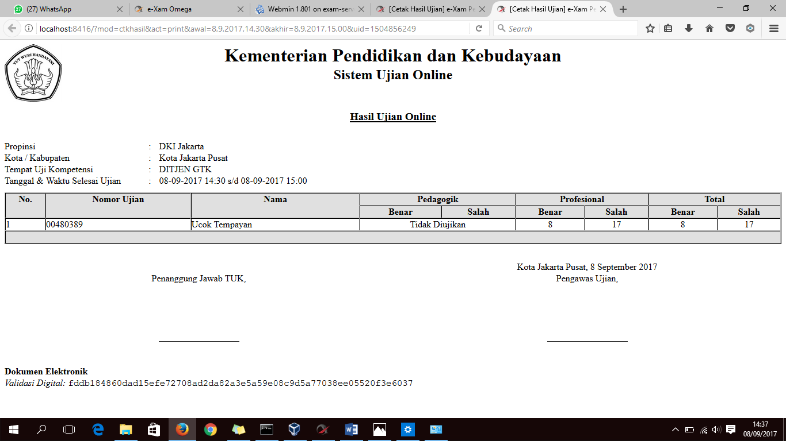

# Pengecekan Hasil Ujian

Ketika peserta telah menyelesaikan ujian, operator TUK **WAJIB** melakukan pengecekan hasil ujian.

1. Memastikan bahwa jawaban peserta **telah terunggah** di server pusat, klik pada menu Pelaporan Hasil Ujian. Jawaban yang terunggah seperti gambar berikut :

1. Memastikan bahwa jumlah peserta pada **Daftar Hadir** dan **Hasil Ujian** **SAMA**.

* Mencetak daftar hadir pada menu Cetak Daftar Hadir.

* Mencetak hasil ujian pada menu Cetak Hasil Ujian, pilih mulai tanggal dan waktu selesai ujian.

